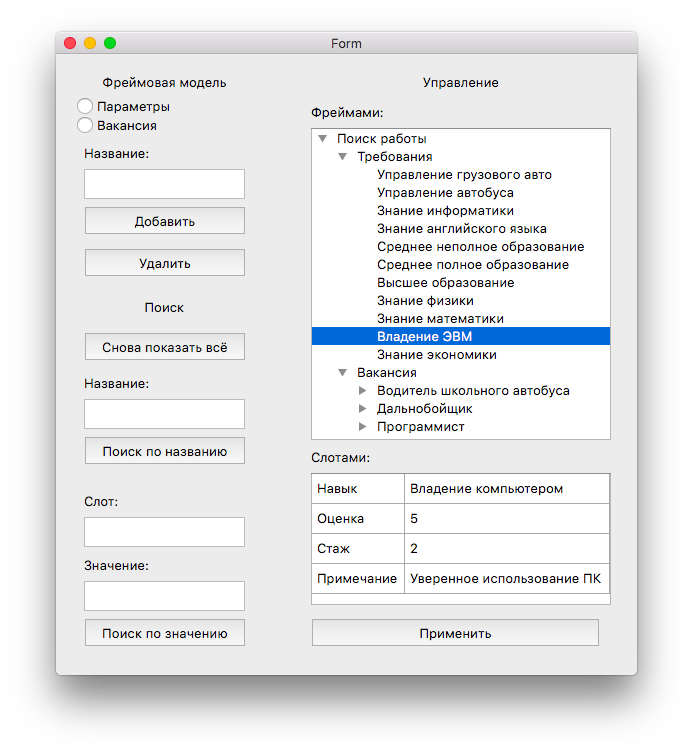

# pyframe
Фреймовая модель на Python.
Предметная область - Поиск/выбор вакансий на работу.

***

<h2> Запуск на windows 10: </h2>
Рекомендуется использовать Python 3

```
git clone https://github.com/vadrx/frame-model
cd frame-model
python main.py
```
